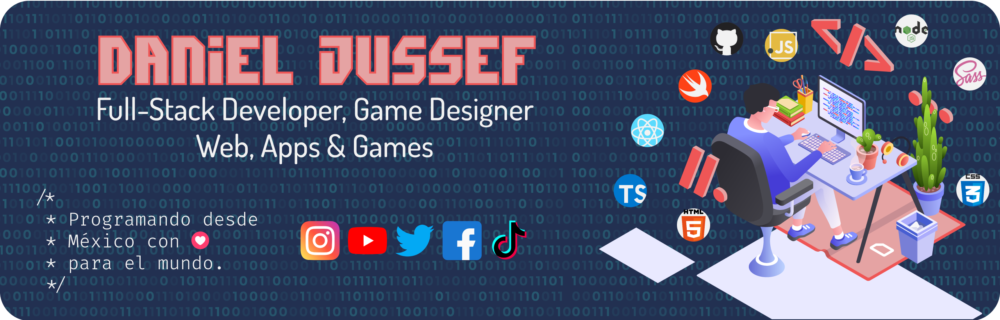

<div align="center">



# 👋 ¡Hola! Soy Jussef


### 💻 Desarrollador apasionado por crear experiencias digitales increíbles

[](https://linktr.ee/jussef)
[](mailto:jussefwebstudio@gmail.com)
[](https://linkedin.com/in/jussef)
[](https://jussef.dev)

</div>

---

## 🚀 Sobre mí

```javascript
const jussef = {
  nombre: "Jussef",
  ubicación: "México 🇲🇽",
  rol: "Full Stack Developer & Game Designer",
  empresa: "Spira México",
  
  código: ["JavaScript", "TypeScript", "Swift", "Kotlin", "C#"],
  tecnologías: {
    frontend: ["React", "React Native", "HTML", "CSS"],
    backend: ["Node.js", "Firebase"],
    mobile: ["React Native", "Swift", "Kotlin"],
    herramientas: ["Git", "GitHub", "Notion", "Jira"],
    diseño: ["Game Design", "UI/UX"]
  },
  
  aprendiendo: ["Mobile Development", "TypeScript avanzado", "Cloud Architecture"],
  hobbies: ["🎮 Gaming", "🎨 Design", "📚 Learning new tech"],
  datoCurioso: "Me encanta combinar diseño de juegos con desarrollo web"
};
```

> 💡 **Siempre buscando aprender y crear cosas increíbles. ¡Conectemos!**

---

## 📊 Estadísticas de GitHub

<div align="center">


### 🔝 Lenguajes Más Usados


</div>

---

## 🛠️ Tecnologías y Herramientas

<div align="center">

### Lenguajes de Programación


### Frontend & Mobile


### Backend & Database


### Herramientas


</div>

---

## 📈 Gráfico de Actividad

<div align="center">


</div>

---

## 🌟 Proyectos Destacados

<div align="center">

[](https://github.com/Jussef/mi-proyecto-1)
[](https://github.com/jussef/mi-proyecto-2)

> 💡 **Trabajando ...**

</div>

---

<div align="center">

## 🤝 Conectemos

<p>
Me encanta conocer gente nueva y colaborar en proyectos interesantes. ¡No dudes en contactarme!
</p>

[](https://linkedin.com/in/jussef)
[](https://twitter.com/jussef)
[](https://jussef.dev)
[](mailto:jussefwebstudio@gmail.com)

<br/>


---

<p>⭐️ From <a href="https://github.com/jussef">jussef</a> with 💙</p>

</div>
